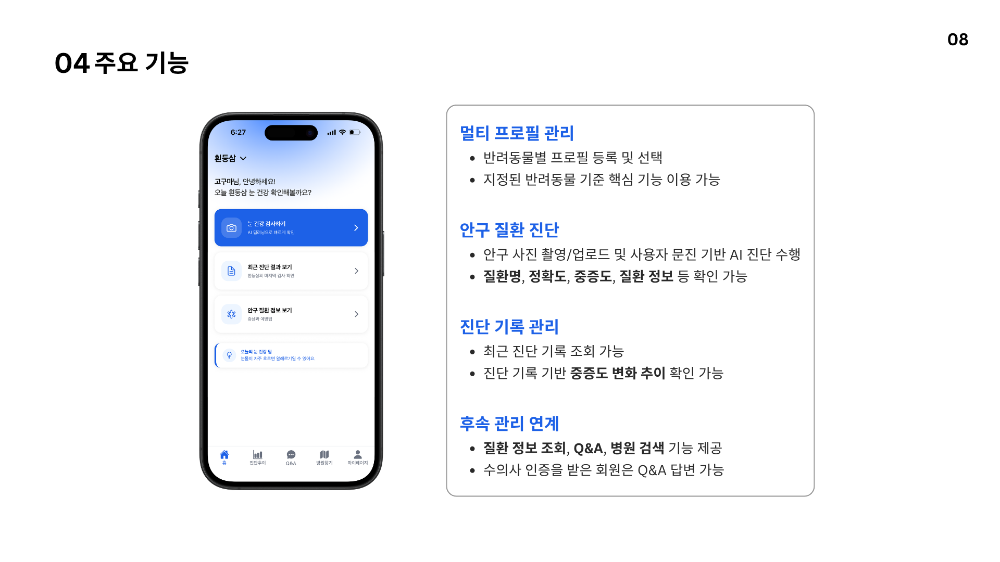
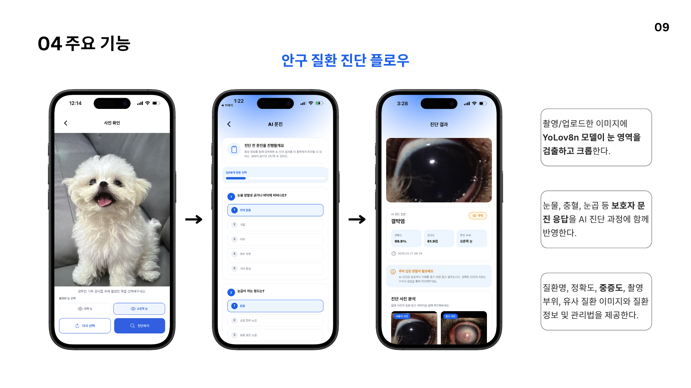
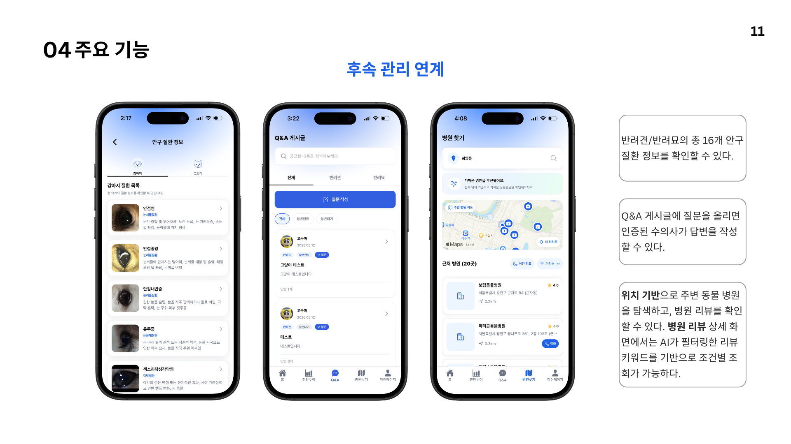
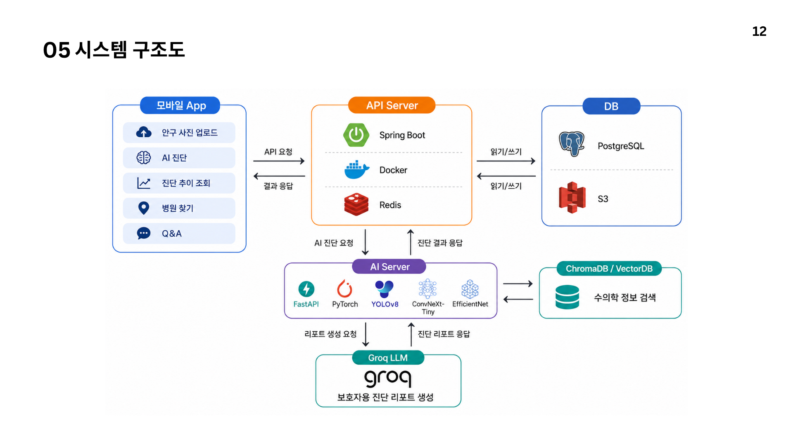
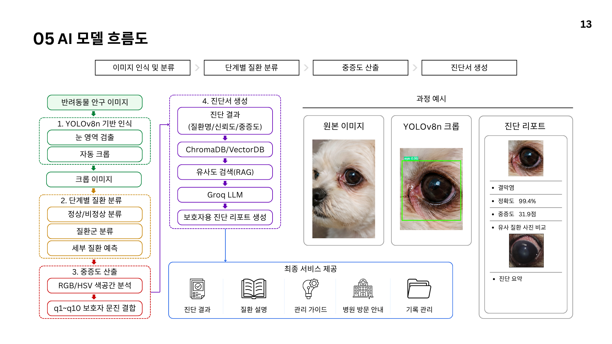
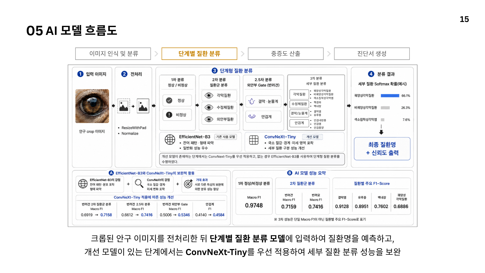
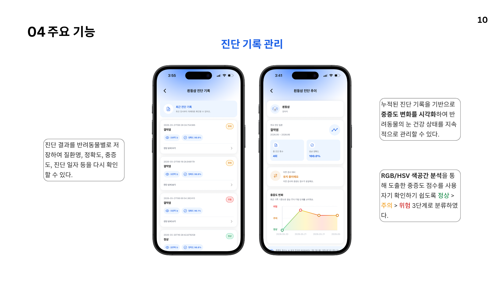
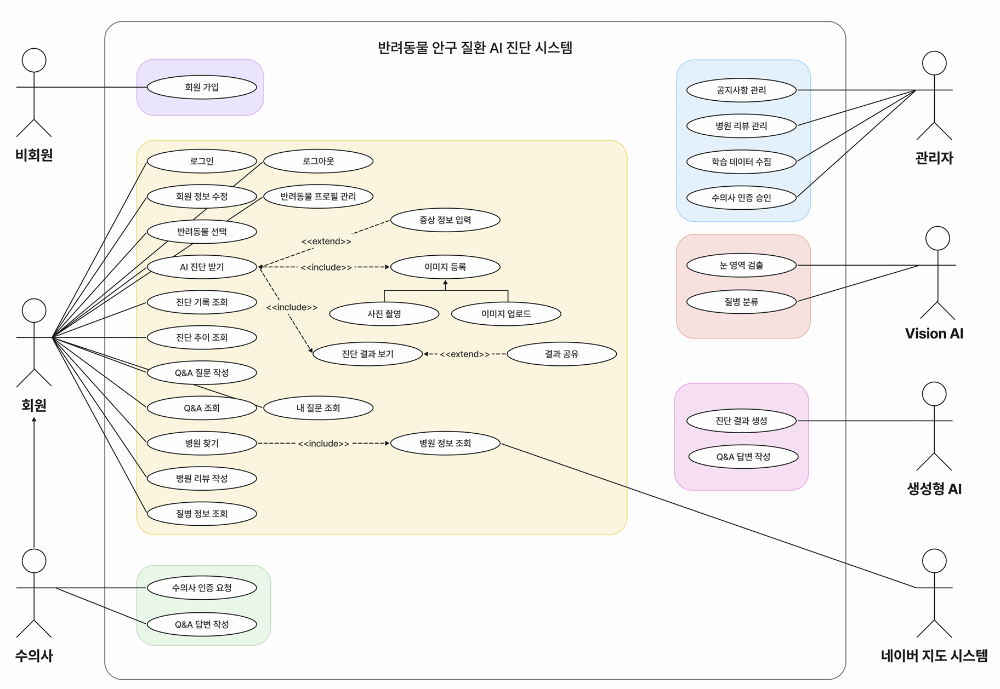
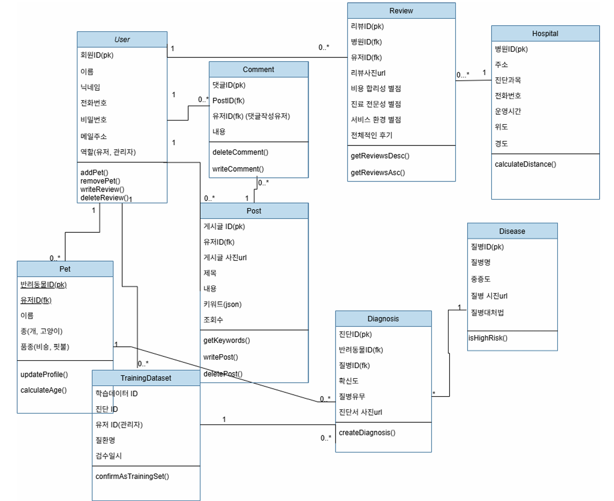
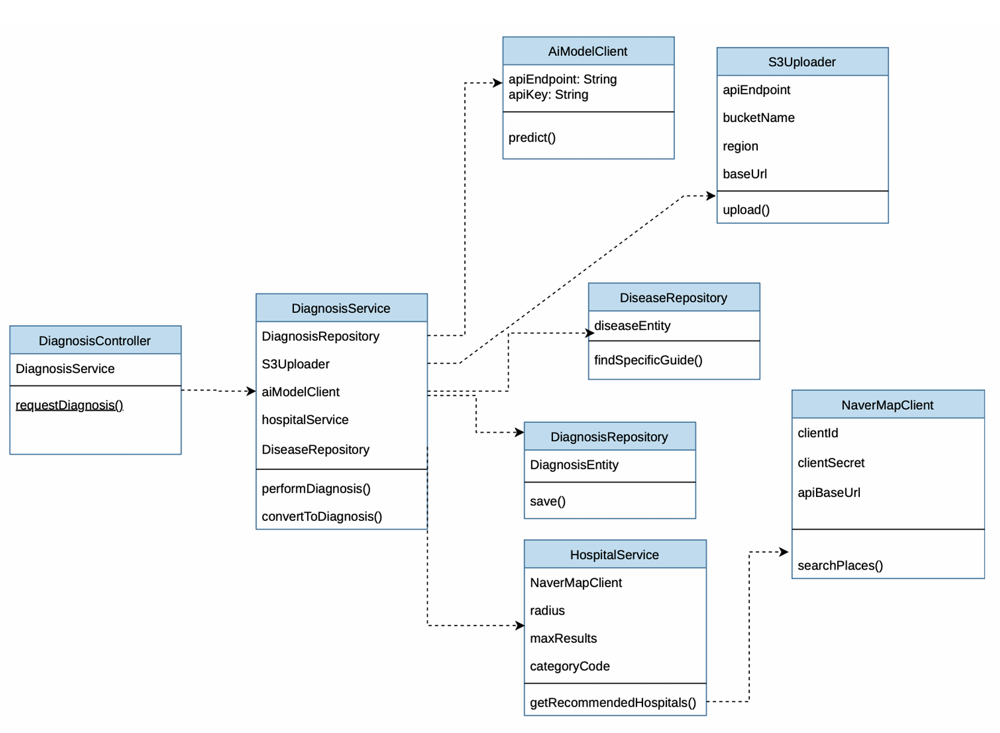

<div align="center">

# 🐾 PetEyes (펫아이즈)

**반려동물 안구질환 AI 진단 서비스**

스마트폰 카메라로 찍은 반려동물(강아지·고양이) 눈 사진을 AI가 분석해 안구질환을 진단하고,
진단 기록 관리부터 병원 연계까지 한 번에 제공하는 모바일 기반 서비스입니다.

세종대학교 SW중심대학사업단 · 2026-1학기 창의설계경진대회 (컴1-04 캡스톤디자인)

</div>

<br>

## 목차

- [소개](#소개)
- [화면 미리보기](#화면-미리보기)
- [주요 기능](#주요-기능)
- [시스템 아키텍처](#시스템-아키텍처)
- [AI 진단 파이프라인](#ai-진단-파이프라인)
- [AI 파트 담당 역할 및 개발 과정](#ai-파트-담당-역할-및-개발-과정)
- [설계 문서](#설계-문서)
- [기술 스택](#기술-스택)
- [프로젝트 구조](#프로젝트-구조)
- [시작하기](#시작하기)
- [팀](#팀)
- [프로젝트 진행 과정](#프로젝트-진행-과정)

<br>

## 소개

반려동물을 키우는 가구는 매년 늘고 있지만, 안구질환은 초기 증상을 보호자가 스스로 알아차리기 어렵고
병원 방문 전까지 방치되기 쉽습니다. 실제로 국내 반려동물 연간 치료비는 2023년 78.7만원에서
2025년 146.3만원으로 크게 늘었습니다.

**PetEyes**는 이 문제를 해결하기 위해 다음 흐름을 하나로 묶었습니다.

> 안구 사진 촬영 → AI 진단(질환명·중증도) → 보호자용 문진서 생성 → 진단 추이 관리 → 주변 병원 연계

보호자, 수의사, 관리자 세 종류의 사용자를 지원하는 웹/앱 서비스로 설계되었습니다.

<br>

## 화면 미리보기

| 로그인 / 홈 | 카메라 / 로딩 | 진단 결과 / 병원 찾기 |
|:---:|:---:|:---:|
|  |  |  |

| 병원 리뷰 | Q&A / 진단 추이 | 관리자 대시보드 |
|:---:|:---:|:---:|
|  |  |  |

수의사용 Q&A 답변 화면은 [`docs/images/screenshots/07-vet-answer.png`](docs/images/screenshots/07-vet-answer.png) 에서 확인할 수 있습니다.
전체 발표 포스터는 [`docs/images/poster.png`](docs/images/poster.png) 를 참고하세요.

<br>

## 주요 기능

### 🐶 보호자
- **AI 안구 진단**: 스마트폰 카메라로 촬영/업로드한 눈 사진을 AI로 분석
- **맞춤형 진단 결과**: 질환명·정확도·중증도와 함께 자연어로 된 리포트(문진서) 제공
- **진단 추이 조회**: 반려동물별 중증도 변화를 그래프로 추적, 상태에 맞는 케어 가이드 제공
- **동물병원 검색 및 리뷰**: 위치 기반 병원 추천, AI 키워드 요약이 포함된 리뷰 열람/작성
- **Q&A 게시판**: 수의사에게 직접 질문하고 답변 받기

### 🩺 수의사
- **Q&A 답변**: 보호자 질문에 1:1 맞춤 답변 작성
- **수의사 인증**: 면허 제출 후 전문가 인증 절차

### 🛠️ 관리자
- 공지사항 관리, 리뷰/Q&A 모더레이션, 광고 관리, 사용자 및 학습 데이터 관리
- 핵심 지표(KPI) 대시보드 및 서비스 통계 모니터링

<br>

## 시스템 아키텍처

```
┌──────────────┐      API 요청      ┌─────────────────────────┐
│   App        │ ───────────────▶ │   API Server              │
│ (React       │                   │  Spring Boot + Redis +    │
│  Native)     │ ◀─────────────── │  Docker                   │
└──────────────┘      결과 응답     └───────┬──────────┬────────┘
                                            │          │
                                     API 요청 │          │ 이미지/데이터
                                            ▼          ▼
                                   ┌────────────┐  ┌─────────────────┐
                                   │  AI Server  │  │  DB              │
                                   │  FastAPI +  │  │  MySQL + S3      │
                                   │  PyTorch    │  └─────────────────┘
                                   └─────┬───────┘
                                         │
                              ┌──────────┴───────────┐
                              ▼                       ▼
                        Groq (Llama 3.1 8B)     ChromaDB (수의학 RAG)
                        → 문진서 생성            → 유사 사례/정보 검색
```

> 발표 포스터에는 DB로 PostgreSQL이 표기되어 있으나, 실제 백엔드 구현체는 **MySQL**을 사용합니다.

<br>

## AI 진단 파이프라인

```
안구 사진 업로드
   ↓  YOLOv8n (mAP@50 0.9769) — 눈 영역 자동 검출/크롭
   ↓  정상 / 비정상 판별
   ↓  ConvNeXt — 질환군 1차 분류
   ↓  EfficientNet-B3 / ConvNeXt — 세부 질환 분류
   ↓  RGB/HSV 색공간 분석 + 보호자 설문 응답 결합 — 중증도 산출
   ↓  ChromaDB(RAG, KR-ELECTRA 임베딩) 수의학 정보 검색
   ↓  Groq API (Llama 3.1 8B) — 보호자용 자연어 문진서 생성
   ↓
진단 결과 반환 (질환명 · 확률 · 중증도 · 증상/치료/원인/대처)
```



- 눈 영역이 자동 검출되지 않으면 사용자가 직접 영역을 지정하거나 재촬영할 수 있도록 폴백을 제공합니다.
- 설문조사(문진)는 선택 사항이며, 스킵하더라도 이미지 기반 분석만으로 결과를 제공합니다.
- RAG 기반 문진서 생성으로 LLM의 환각(hallucination)을 방지합니다.

<br>

## AI 파트 담당 역할 및 개발 과정

> 스마트폰 사진 한 장으로 반려동물의 안구 질환을 진단하고, 수의학 근거 기반 문진서를 자동 생성하는 AI 파이프라인입니다.
> 단순한 정상/비정상 판별에 그치지 않고, **정상/비정상 → 질환군 → 세부 질환명** 3단계로 분류하는 계층 구조를 직접 설계·구현했습니다.

### 담당 역할

- AI 파이프라인 전체 설계 및 구현 (단독)
- YOLOv8n 안구 검출 모델 학습 및 크롭 로직 구현
- EfficientNet-B3 / ConvNeXt-Tiny 단계적 분류 모델 학습
- RGB/HSV 색공간 기반 중증도 정량화 로직 구현
- ChromaDB + Groq 기반 RAG 문진서 자동 생성 구현
- FastAPI AI 서버 구축 및 ngrok 연동

### 실제 요청 흐름

```
React Native 앱
    ↓ 이미지 + 설문
Spring Boot 백엔드 (AWS EC2)
    ↓ 진단 요청
FastAPI AI 서버 (로컬 + ngrok)
    ① YOLOv8n 안구 검출
    ② 1차: 정상/비정상 (F1 0.97)
    ③ 2차: 질환군 분류
    ④ 3차: 세부 질환명 (반려견 11종, 반려묘 6종)
    ⑤ RGB/HSV + 설문 → 중증도 점수
    ⑥ ChromaDB RAG → Groq 문진서 생성
```

### 기술 선택 이유

| 기술 | 선택 이유 |
|---|---|
| EfficientNet-B3 | 파라미터 효율이 높고 의료 이미지 분류에서 안정적인 성능 |
| ConvNeXt-Tiny | 384px 고해상도 입력에서 미세한 질환 특징 포착, 2차 분류 성능 향상 확인 |
| ChromaDB | 외부 API 없이 로컬에서 수의학 문서 102개 청크 벡터 검색 가능 |
| Groq (Llama 3.1 8B) | 낮은 레이턴시와 RAG 컨텍스트 결합으로 환각 없는 문진서 생성 |
| LangChain 미사용 | ChromaDB SDK와 Groq SDK를 직접 연동하여 불필요한 추상화 없이 경량 구성 |

### 문제 → 해결 과정

**① Google Drive I/O 병목**
학습 데이터 20만장을 Drive에서 직접 읽으니 GPU 사용률이 20% 이하로 떨어졌습니다. DataLoader 병렬 I/O와 Drive의 순차 접근 방식이 맞지 않은 것이 원인이었습니다. 데이터를 Colab 로컬 디스크로 전체 복사 후 학습하는 방식으로 전환하여 GPU 활용률을 80% 이상으로 회복했습니다.

**② 2차 오분류 시 오류 누적**
2차 질환군에서 한 번 틀리면 3차 세부 질환이 아무리 정확해도 최종 질환명이 절대 맞을 수 없는 구조적 문제가 있었습니다. EfficientNet-B3 300px → ConvNeXt-Tiny 384px + CutMix 증강으로 2차 모델을 교체하고, 외안부질환을 결막눈물계/안검계로 2단계 분기하는 계층 구조로 재설계했습니다.

**③ YOLO bbox 과도한 크롭**
YOLO가 눈알만 타이트하게 잘라 주변 조직 정보가 사라지면서 분류 정확도가 떨어졌습니다. 학습 시에는 눈 + 눈꺼풀 + 주변 털이 포함된 이미지를 사용했는데 추론 시 입력 분포가 달라진 게 원인이었습니다. bbox 크기의 40% 패딩을 추가하고, 면적 비율이 3% 미만이거나 65% 초과인 이상 bbox는 원본 이미지를 사용하는 fallback 로직을 추가했습니다.

**④ 모바일 이미지 업로드 413 오류**
앱에서 고해상도 이미지를 그대로 전송하면 서버에서 Request Entity Too Large 오류가 발생했습니다. Spring Boot multipart 설정을 10MB로 조정하고, 앱 단에서 1024px 리사이즈 + JPEG 70% 압축을 적용하여 평균 5MB → 300KB로 줄였습니다.

### 성과

- ✅ AI 파이프라인 단독 설계 및 구현 (YOLO + EfficientNet + ConvNeXt + RAG)
- ✅ 1차 정상/비정상 분류 F1 0.97 달성
- ✅ YOLO 안구 검출 mAP@50 0.9769 달성
- ✅ ChromaDB 수의학 근거 102개 청크 구축
- ✅ 모바일 앱 → 백엔드 → AI 서버 End-to-End 연동 완성
- ✅ 반려견 11종, 반려묘 6종 세부 질환 분류 구조 완성

<br>

## 설계 문서

<details>
<summary><b>유스케이스 다이어그램</b> (클릭해서 펼치기)</summary>
<br>



</details>

<details>
<summary><b>도메인 모델 (클래스 다이어그램)</b></summary>
<br>



</details>

<details>
<summary><b>진단(Diagnosis) 서비스 계층 클래스 다이어그램</b></summary>
<br>



</details>

<br>

## 기술 스택

| 영역 | 스택 |
|---|---|
| **Frontend** | React Native, Expo Camera, TypeScript, NativeWind, Zustand |
| **Backend** | Spring Boot 3.5 (Java 17), Spring Security + OAuth2(Naver/Kakao), Spring Data JPA, MySQL, JWT(jjwt), AWS S3 SDK, springdoc-openapi |
| **AI Server** | FastAPI, PyTorch, Ultralytics YOLOv8n, timm(EfficientNet-B3), ChromaDB, sentence-transformers, Groq(Llama 3.1 8B) |
| **Infra** | Docker, GitHub Actions(CI/CD), Nginx, AWS S3, DockerHub |

> 발표 자료에는 PostgreSQL / MongoDB / Redis / Terraform / Prometheus·Grafana 등도 기술 스택 후보로 표기되어 있으나,
> 이 저장소의 실제 구현 기준 스택은 위 표를 따릅니다.

<br>

## 프로젝트 구조

```
PetEyes-AI/
├── backend/               # Spring Boot API 서버
│   ├── src/main/java/com/capstone/backend/
│   │   ├── auth/          # 회원가입·로그인·OAuth(Naver/Kakao)·JWT
│   │   ├── user/          # 회원 정보, 수의사 인증
│   │   ├── pet/           # 반려동물 프로필
│   │   ├── diagnosis/     # 진단 기록·추이
│   │   ├── disease/       # 질환 정보
│   │   ├── hospital/      # 병원 검색(네이버 지도 연동)
│   │   ├── review/        # 병원 리뷰
│   │   ├── qna/           # Q&A 게시판
│   │   ├── image/         # S3 이미지 업로드
│   │   ├── ai/             # AI 서버 연동 클라이언트
│   │   └── admin/         # 관리자 기능
│   ├── docs/API.md        # API 명세
│   ├── scripts/           # DB 시드/이미지 업로드 스크립트
│   └── Dockerfile, docker-compose.yml
│
├── ai-server/              # FastAPI 기반 AI 추론 서버
│   ├── ai_server.py        # YOLOv8n·분류 모델·RAG·Groq 파이프라인
│   ├── setup_ragChroma.py  # ChromaDB(RAG) 초기 구축 스크립트
│   └── requirements.txt
│
├── frontend/                # React Native(Expo) 앱 — 추가 예정
│
├── docs/images/             # 다이어그램 및 스크린샷
└── .github/workflows/       # CI/CD (backend Docker 빌드·배포)
```

> `frontend/` 는 아직 이 저장소에 포함되지 않았습니다. 곧 추가될 예정입니다.

<br>

## 시작하기

### 1. 백엔드 (Spring Boot)

```bash
cd backend
cp .env.example .env   # 값 채워 넣기 (DB, JWT, OAuth, S3 등)
./gradlew bootRun
```

- 로컬 실행 시 MySQL(`dev_db`)이 떠 있어야 합니다. 필요한 환경 변수는 [`backend/.env.example`](backend/.env.example) 참고.
- 서버 실행 후 API 문서는 `http://localhost:8080/swagger` 에서 확인할 수 있습니다.
- 전체 엔드포인트 목록은 [`backend/docs/API.md`](backend/docs/API.md) 참고.

### 2. AI 서버 (FastAPI)

```bash
cd ai-server
pip install -r requirements.txt
cp .env.example .env   # GROQ_API_KEY 채워 넣기
python setup_ragChroma.py   # ChromaDB(RAG) 최초 1회 구축
uvicorn ai_server:app --host 0.0.0.0 --port 8000
```

- 모델 가중치(YOLOv8n, EfficientNet-B3 등)는 `ai-server/models/` 에 별도로 배치해야 합니다(저장소에는 포함되지 않음).
- 자세한 내용은 [`ai-server/README.md`](ai-server/README.md) 참고.

### 3. Docker로 백엔드 + DB 함께 띄우기

```bash
cd backend
docker compose up -d
```

<br>

## 팀

**4조 아무거나 (AMU-GUNA)** · 세종대학교 컴퓨터공학과 캡스톤디자인

| 이름 | 역할 |
|---|---|
| 조형배 | AI 개발 |
| 이서정 | Frontend 개발 |
| 박유진 | Backend 개발 |
| 이승준 | Backend 개발 |

> 이 저장소의 GitHub 협업자는 연락이 닿은 AI/Frontend 담당 2인입니다. Backend 코드는 팀원들이 작성한 원본을 그대로 포함하고 있으며,
> 프로젝트 전체 내용을 온전히 남기기 위해 함께 정리해 올렸습니다.

<br>

## 프로젝트 진행 과정

| 단계 | 내용 |
|---|---|
| 01. Discovery | 요구사항 분석(SRS), 유스케이스·UML 설계, IA·와이어프레임 |
| 02. 프로토타입 및 검증 | Figma 목업 제작, FastAPI 기본 구조, YOLOv8n PoC 검증 |
| 03. MVP 개발 | AI 파이프라인 구현, 진단 결과·추이 UI, 병원 찾기·Q&A 연동 |
| 04. 완성 및 고도화 | 통합 테스트·최적화, 최종 발표·데모, 캡스톤 최종 제출 |

개발 방법론으로는 요구사항 변경과 AI 성능의 불확실성에 대응하기 위해
**프로토타입(Figma 클릭형 UI) + 애자일(Scrum, 스프린트 기반 반복 개발)** 을 혼합해 채택했습니다.

<br>

---

<div align="center">

근거 있는 UX/UI 설계로 사용자의 진짜 문제를 해결하다 — PetEyes

</div>
